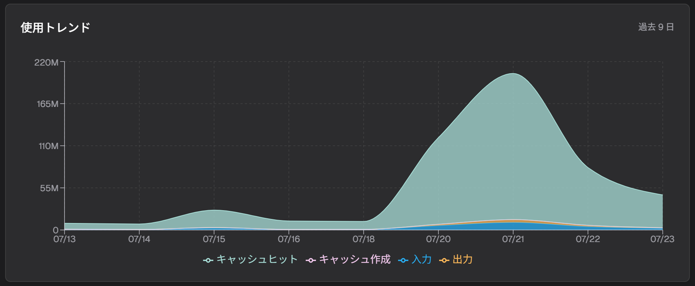
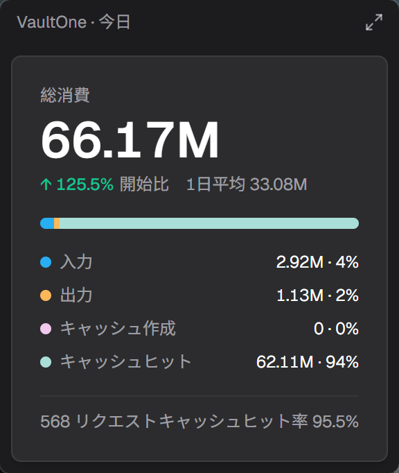

# VaultOne

> Claude Code のトークン使用量とコストを可視化する、ローカルファーストのデスクトップダッシュボード。Claude Code が既に書き出しているセッションログを直接読み取り、必要に応じて自分が管理する GitHub リポジトリ経由で複数端末間同期できます。

[](https://github.com/Buktal/VaultOne/releases)
[](https://github.com/Buktal/VaultOne/releases)
[](./LICENSE)
[](https://tauri.app/)

[English](./README.md) | [简体中文](./README.zh-CN.md) | **日本語** | [更新履歴](./CHANGELOG.ja-JP.md)



*ライトウェイトモード —— 画面端に格納し、ホバーで今日の使用量をちらっと確認:*



---

## なぜ VaultOne？

Claude Code は実行のたびにセッションログをディスクに書き出します。VaultOne はそのログを鮮明な使用量の姿——**トークン・コスト・キャッシュ効率・トレンド**——に変えます。プロキシを組み立てたり、API キーを渡したり、データをどこかへ送信したりする必要はありません。

製品全体を形作る 2 つのスタンス:

- **ローカルファースト。** ダッシュボードはネットワークゼロで動きます。自分のログを読むだけで十分です。
- **読み取り専用。** VaultOne はセッションログを*読む*だけです。決して変更せず、Claude Code の挙動にも一切干渉しません。Claude Code は以前と全く同じように動き続けます。

複数端末間同期は存在しますが、純粋に**オプトイン**の上乗せ層であり、アプリを使うための前提では決してありません。

## ハイライト

- **ツールが既に吐くログを読む** —— Claude Code のセッションログをディスクから直接解析。プロキシ不要、API キー不要、ダッシュボードの利用にネットワーク不要。
- **自分の GitHub リポジトリで複数端末同期** —— 使用量データはプレーンテキストとして、端末と日付で分割され、あなたが管理するリポジトリに書き出されます。間に第三者サービスを挟みません。
- **実際の課金に合うトークン口径** —— 4 バケット消費（input / output / cache creation / cache read）、キャッシュヒット率、コストを、収集時に取得して固定。
- **ライトウェイトモード** —— 画面端に半分アイコンとして配置。完全なダッシュボードを開かずに、ホバーで今日の使用量をちらっと確認。
- **トレイ常駐のバックグラウンド収集** —— 増分スキャナが背後でダッシュボードを最新に保ちます。ウィンドウ不要。
- **コールごと・ターンごとのビュー** —— すべてのモデル呼び出し（コスト・所要時間・`stop_reason` の意味）にドリルダウンし、ターン全体のコストと実所要時間にロールアップ。

## ダウンロード

**[Releases](https://github.com/Buktal/VaultOne/releases)** ページから、お使いの OS 向けインストーラを入手してください。

| OS | インストーラ |
| --- | --- |
| **Windows** | `.msi` または `.exe`（NSIS）セットアップ |
| **macOS** | `.dmg`（Apple Silicon / arm64） |
| **Linux** | `.deb`、`.AppImage`（入手可能なら `.rpm`） |

**初回起動:** VaultOne を起動すると、ローカルの Claude Code セッションログをスキャンし、ダッシュボードが埋まります。アカウント不要、サインイン不要、ネットワーク不要。複数台で使用量を見るには、**設定**で同期を有効にし、自分が管理する GitHub リポジトリを指定します。

> **macOS の注意:** 現在のビルドは未署名です。初回起動時にアプリを右クリック → **開く**、もしくは隔離属性を除去してください:
> ```bash
> xattr -dr com.apple.quarantine /Applications/VaultOne.app
> ```

## 機能

### ダッシュボード

- **4 バケットのトークン消費** —— input、output、cache creation、cache read。
- **キャッシュヒット率** —— `cache_read / (input + cache_creation + cache_read)`。上流の使用量集計と整合。
- **リクエスト数とコスト** —— 総リクエスト数と総コスト（USD）、収集時に固定。
- **使用量トレンド** —— 時間経過に伴うトークン対コストの双軸チャート、シリーズの切替可能。
- **コールごとのリクエストログ** —— モデル、トークン内訳、コスト、ターン所要時間、`stop_reason` / `service_tier` チップ。
- **ターンごとのビュー** —— ターン全体のコストと実所要時間、単一コールの計時とは別。

### 収集

- **読み取り専用ソース** —— Claude Code が既に書き出すセッションログを解析。決して変更しません。
- **増分スキャン** —— カーソルベースのスキャナが変化分だけを拾います。
- **トレイ常駐のバックグラウンドスケジューラ** —— ウィンドウを開いたままにせず、タイマーで収集します。
- **現在は Claude Code、追加プロバイダを計画中** —— 収集器はプラグイン可能なプロバイダモデルで構築。

### 同期（任意）

- **スタンドアローンモード** —— 完全なダッシュボード、ネットワークゼロ。
- **同期モード** —— 自分が管理する GitHub リポジトリ経由で、端末間の使用量を整合。
- **プレーンテキストのアーティファクト** —— 端末と日付で分割（`data/<device>/usage-YYYY-MM-DD.jsonl`）。diff が読みやすく査読可能。

### コストと価格

- **編集可能なモデルごとの価格** —— シード価格を上書き。VaultOne はあなたの数値を使います。
- **再請求（Rebill）** —— 収集時に価格が無かったレコードを遡って計上。既存履歴を再計算しません。

### 体験

- **ライトウェイトモード** —— エッジ格納 + ホバーで今日の使用量をちらっと確認。
- **カスタムタイトルバー、ライト / ダークテーマ。**
- **デフォルトでプライベート** —— 同期を有効にしない限り、使用量データはあなたの端末に留まります。

## 仕組み

```
  Claude Code セッションログ
          │ （読み取り専用）
          ▼
       収集 ──────▶ ローカルストア ──────▶ ダッシュボード
          │
          │ （任意 · 同期モード）
          ▼
   アーティファクト（プレーンテキスト、端末 + 日付ごと）
          │
    あなたの GitHub リポジトリで push / pull
          │
          ▼
     他の端末
```

- **収集（Collect）** はローカルのソースログを読み、解析してローカルストアに書き込み（同期アーティファクトも生成）します。
- **ローカルストア（Local store）** はダッシュボードが読むクエリ層です。
- **同期（Sync、オプトイン）** は GitHub リポジトリ経由で端末間のアーティファクトを push / pull します。

## ソースからビルド

**前提条件:** [Node.js](https://nodejs.org/) LTS + [Yarn](https://yarnpkg.com/)、および [Rust](https://www.rust-lang.org/) stable（OS ごとの [Tauri の前提条件](https://tauri.app/start/prerequisites/)を参照）。

```bash
yarn install        # フロントエンド依存をインストール
yarn dev            # デスクトップアプリを開発モードで実行
yarn dist           # リリース版デスクトップバイナリをビルド
```

| コマンド | 説明 |
| --- | --- |
| `yarn dev` | 完全な Tauri デスクトップアプリを開発モードで実行（Vite + Rust）。 |
| `yarn web:dev` | Web UI のみを実行（Vite）、フロントエンド単独の反復用。 |
| `yarn check` | 静的チェック総括——フロント（Biome + tsc）と Rust（fmt + clippy）。CI と同構。 |
| `yarn web:fix` | フロントエンドの lint とフォーマットを自動修正（Biome）。 |
| `yarn web:build` | 型チェックして Web バンドルをビルド。 |
| `yarn test` | 全テストを実行（Rust スイート）。 |
| `yarn dist` | リリース版デスクトップバイナリをビルド。 |

**技術スタック:** [Tauri 2](https://tauri.app/)（Rust）· [React 19](https://react.dev/) · [TypeScript](https://www.typescriptlang.org/) · [Vite](https://vite.dev/) · [Tailwind CSS v4](https://tailwindcss.com/) · [shadcn/ui](https://ui.shadcn.com/) · [Redux Toolkit](https://redux-toolkit.js.org/) · [Recharts](https://recharts.org/)

## アーキテクチャ

[Tauri 2](https://tauri.app/) アプリ: Rust バックエンドが収集・ローカルストア・オプションの Git リポジトリ同期を担い、React フロントエンドが生成された型安全な IPC バインディング経由でダッシュボードを描画します。収集器はプラグイン可能なプロバイダモデル（現在は Claude Code）、ローカルストアはダッシュボードの唯一の読み取り元、同期はそのストアを端末と日付で分割したプレーンテキストのアーティファクトへ投影するオプトインの層です。

## コントリビュート

Issue と提案を歓迎します。PR を出す前に `yarn check` と `yarn test` を実行し、CI ゲートをローカルで通してください。大きな機能は、まず Issue を開いて方針を議論してください。

## ライセンス

[MIT](./LICENSE) © VaultOne Contributors
