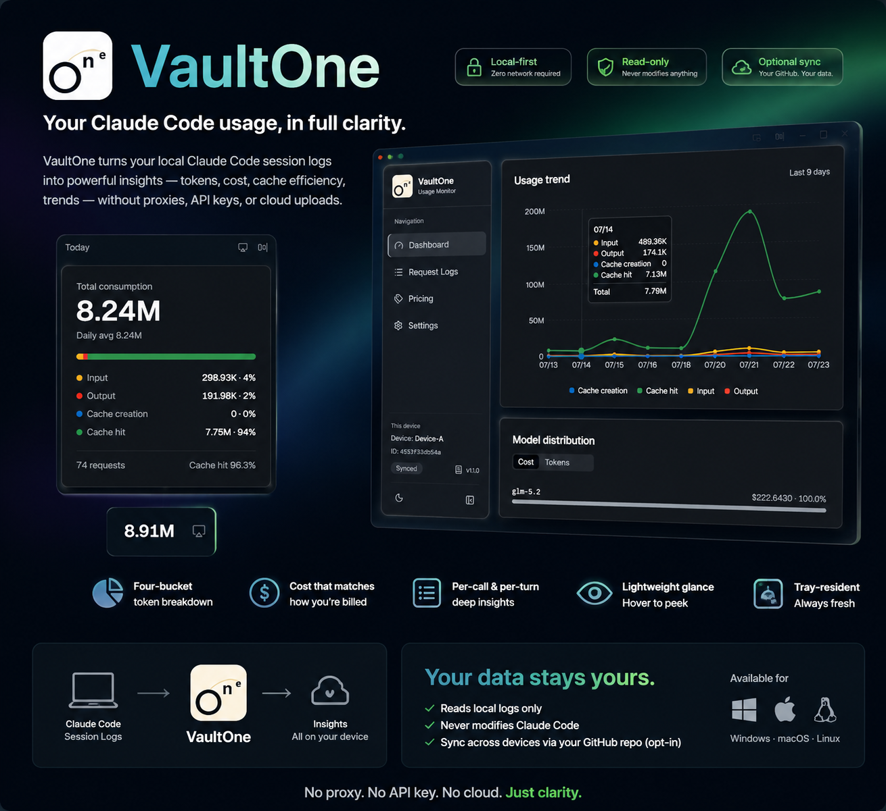
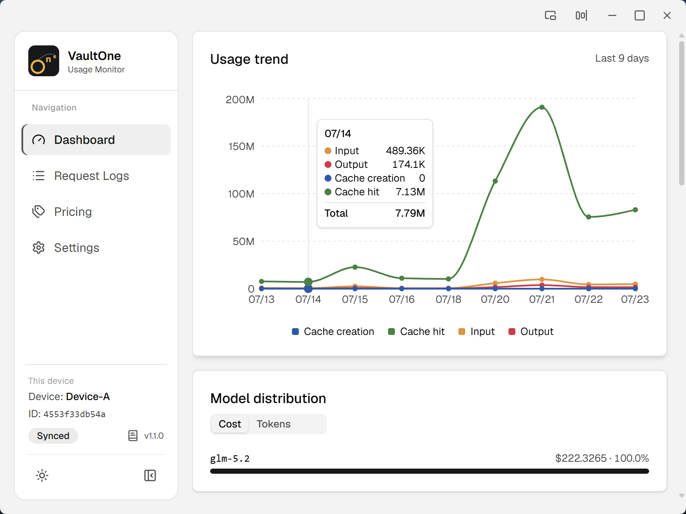
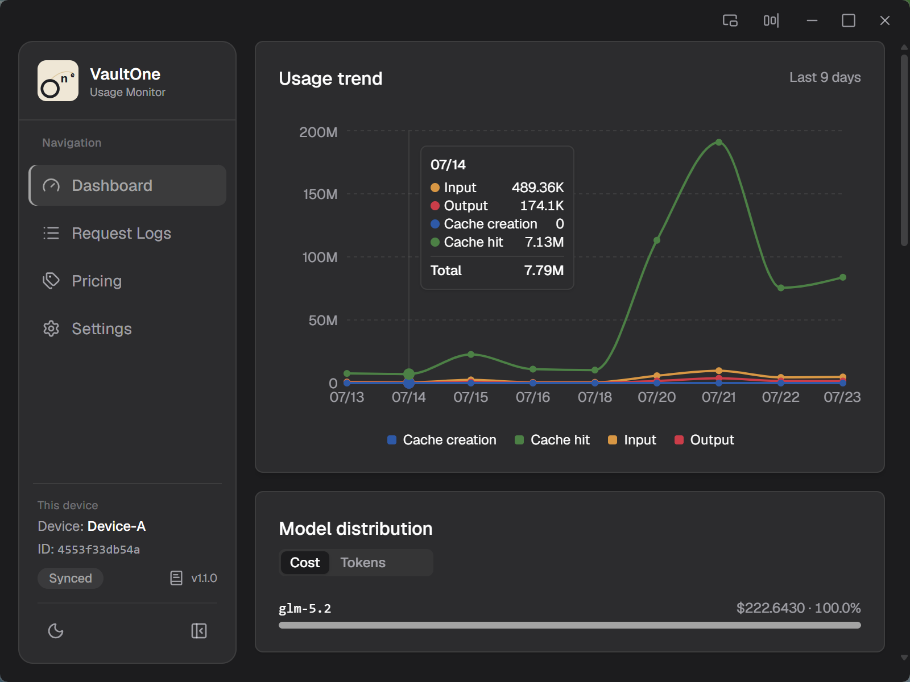
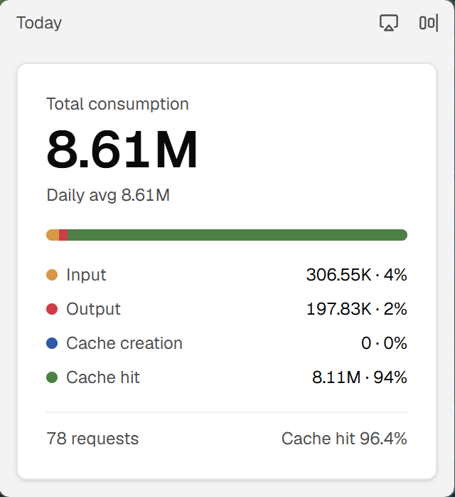
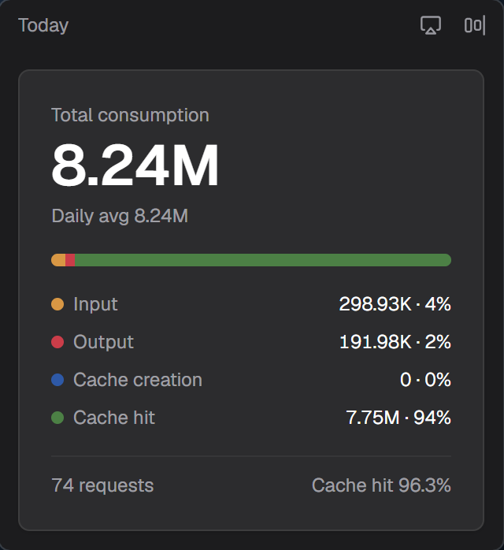

# VaultOne

> **VaultOne doesn't store your AI data. It helps you understand and manage data you already own.**

> A local-first desktop dashboard for your Claude Code token usage and cost — read straight from the session logs Claude Code already writes, with optional multi-device sync through a GitHub repo you control.

[](https://github.com/Buktal/VaultOne/releases)
[](https://github.com/Buktal/VaultOne/releases)
[](./LICENSE)
[](https://tauri.app/)

**English** | [简体中文](./README.zh-CN.md) | [日本語](./README.ja-JP.md) | [Changelog](./CHANGELOG.md)



---

## Why VaultOne?

Every time Claude Code runs, it writes session logs to disk. VaultOne turns those logs into a clear usage picture — **tokens, cost, cache efficiency, trends** — without a proxy, an API key, or sending anything anywhere.

Two stances shape the whole product:

- **Local-first.** The dashboard works with zero network — reading your own logs is all it needs.
- **Read-only.** VaultOne only ever *reads* the session logs; it never modifies them and never touches Claude Code's behavior. Claude Code keeps running exactly as before.

Multi-device sync is a purely **opt-in** layer on top — never a precondition.

## Highlights

- **Reads logs your tools already produce** — parses Claude Code session logs straight off disk. No proxy, no API key, no network.
- **Token economics that match your bill** — four-bucket consumption (input / output / cache creation / cache read), cache-hit rate, and cost frozen at collection time.
- **Multi-device sync through your own GitHub repo** — plain-text artifacts partitioned by device and date, in a repo you own. No third party in the middle.
- **Lightweight glance mode** — tuck a mini-bar to the screen edge that always shows today's total, or expand into a floating card mirroring the dashboard. Switch full ⇄ expanded ⇄ tucked from any shape.
- **Multi-skin theming** — five accent + chart palettes (Neutral, Sage, Azure, Crimson, Mauve); recolor the whole app without touching content.
- **Tray-resident background collection** — an incremental scanner keeps the dashboard fresh behind the scenes.
- **Auto-update & three languages** — install signed updates straight from GitHub Releases; UI in English, 简体中文, or 日本語.

## Screenshots

| | Light | Dark |
| --- | --- | --- |
| **Dashboard** |  |  |
| **Consumption** |  |  |
| **Glance mode** |  |  |

## Download

Grab the installer for your OS from the **[Releases](https://github.com/Buktal/VaultOne/releases)** page.

| OS | Installer |
| --- | --- |
| **Windows** | `.msi` or `.exe` (NSIS) setup |
| **macOS** | `.dmg` (Apple Silicon, arm64) |
| **Linux** | `.deb`, `.AppImage` (`.rpm` where available) |

**First run:** launch VaultOne — it scans your local Claude Code session logs and the dashboard fills in. No account, no sign-in, no network. To see usage across machines, enable sync in **Settings** and point VaultOne at a GitHub repo you control.

> **macOS note:** builds are currently unsigned. On first launch, right-click the app → **Open**, or strip the quarantine attribute:
> ```bash
> xattr -dr com.apple.quarantine /Applications/VaultOne.app
> ```

## Features

### Dashboard

- **Four-bucket token consumption** — input, output, cache creation, cache read.
- **Cache-hit rate** — `cache_read / (input + cache_creation + cache_read)`, aligned with how upstream usage is counted.
- **Requests & cost** — total request count and total cost (USD), frozen at collection time.
- **Usage trends** — multi-line token-vs-cost chart over time, one series per metric.
- **Per-call request log** — model, token breakdown, cost, turn duration, and `stop_reason` / `service_tier` chips.
- **Per-turn view** — whole-turn cost and wall-clock duration, separate from single-call timing.

### Collection

- **Read-only source** — parses the session logs Claude Code already writes; never modifies them.
- **Incremental scan** — a cursor-based scanner picks up only what changed.
- **Tray-resident scheduler** — collects on a timer without keeping a window open.
- **Pluggable providers** — Claude Code today, more planned.

### Sync (optional)

- **Standalone mode** — full dashboard, zero network.
- **Synced mode** — align usage across devices through a GitHub repo you own.
- **Plain-text artifacts** — partitioned by device and date (`data/<device>/usage-YYYY-MM-DD.jsonl`), so diffs stay readable and reviewable.

### Cost & pricing

- **Editable per-model pricing** — override seed prices; VaultOne uses your numbers.
- **Rebill** — backfill records that had no price when collected, without re-costing existing history.

### Experience

- **Lightweight glance mode** — edge-tucked mini-bar + expandable floating card.
- **Multi-skin theming** — five palettes; Neutral (greyscale) by default.
- **Auto-update** — signed installers straight from GitHub Releases, with a manual check in Settings.
- **Light / dark theme, three languages, private by default** — usage data stays on your machines unless you opt into sync.

## How it works

```
  Claude Code session logs
          │  (read-only)
          ▼
       Collect ──────▶ Local store ──────▶ Dashboard
          │
          │  (optional · Synced mode)
          ▼
   Artifact (plain text, per device + date)
          │
    push / pull via your GitHub repo
          │
          ▼
     Other devices
```

A [Tauri 2](https://tauri.app/) app: a Rust backend handles collection, the local store, and optional Git-repo sync; a React frontend renders the dashboard through generated, type-safe IPC bindings. The collector is a pluggable provider model (Claude Code today), the local store is the dashboard's single read source, and sync is an opt-in projection of that store into plain-text artifacts partitioned by device and date.

## Build from source

**Prerequisites:** [Node.js](https://nodejs.org/) LTS + [Yarn](https://yarnpkg.com/), and [Rust](https://www.rust-lang.org/) stable with the [Tauri prerequisites](https://tauri.app/start/prerequisites/) for your OS.

```bash
yarn install     # install dependencies
yarn dev         # run the desktop app in development
yarn dist        # build a release binary
yarn check       # static checks (Biome + tsc + Rust fmt/clippy) — same gates as CI
yarn test        # run the test suite
```

**Tech stack:** [Tauri 2](https://tauri.app/) (Rust) · [React 19](https://react.dev/) · [TypeScript](https://www.typescriptlang.org/) · [Vite](https://vite.dev/) · [Tailwind CSS v4](https://tailwindcss.com/) · [shadcn/ui](https://ui.shadcn.com/) · [Redux Toolkit](https://redux-toolkit.js.org/) · [Recharts](https://recharts.org/)

## Contributing

Issues and suggestions are welcome. Before a PR, run `yarn check` and `yarn test`. For larger features, open an issue to discuss the approach first.

## License

[MIT](./LICENSE) © VaultOne Contributors
