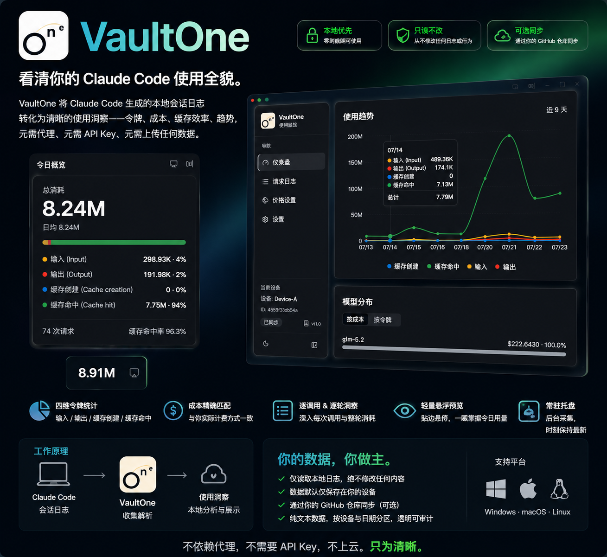
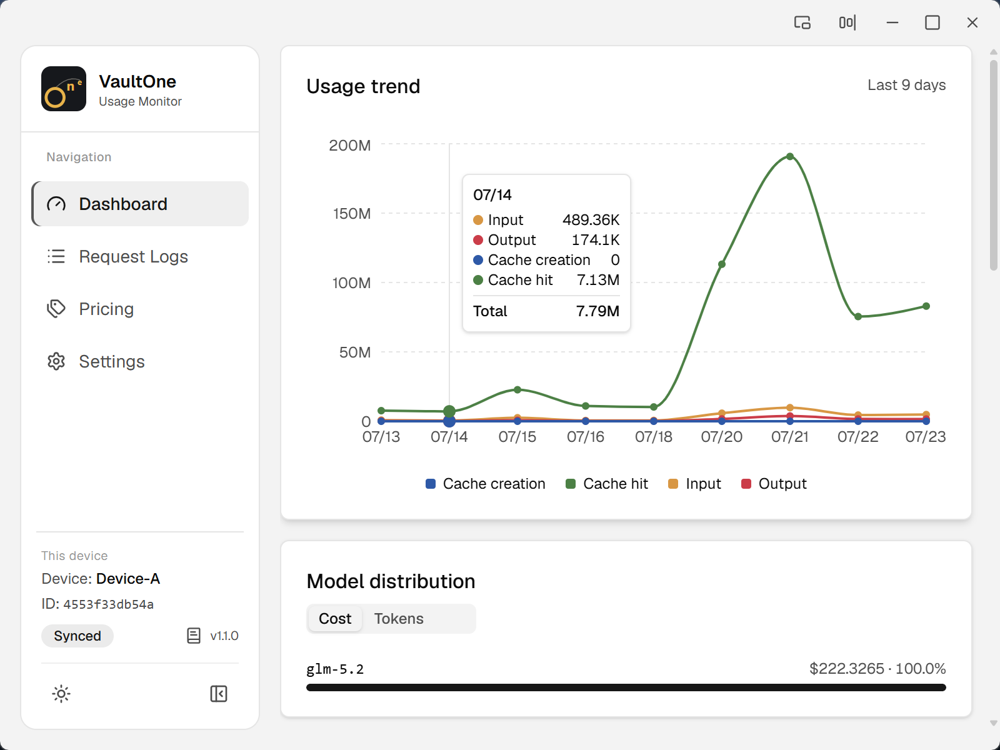
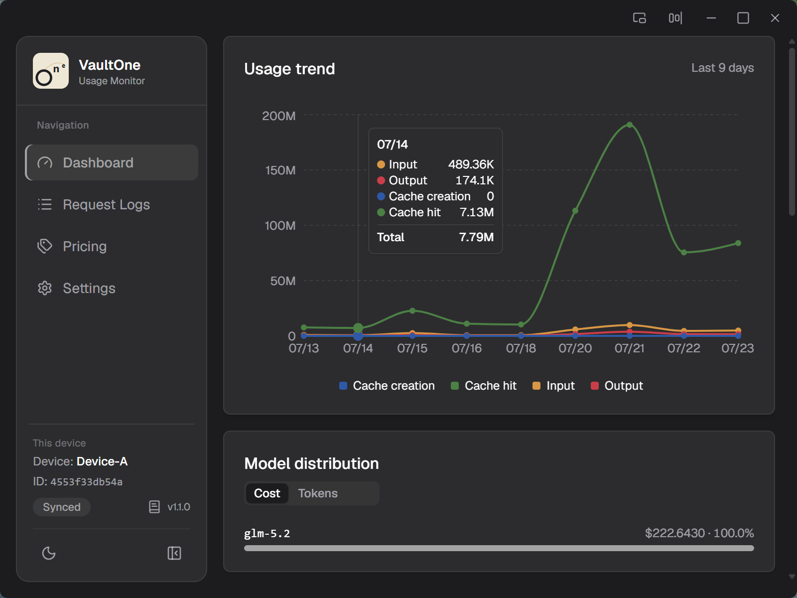
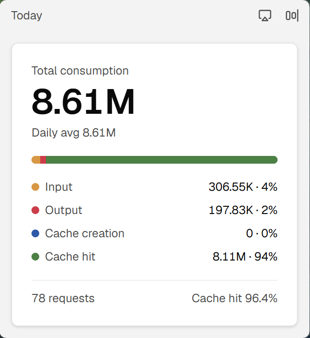
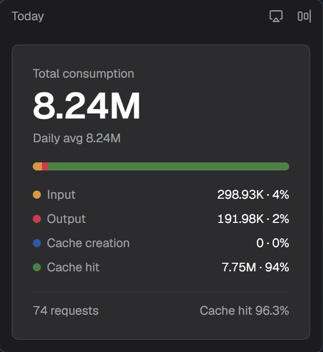

# VaultOne

> **VaultOne 不保存你的 AI 数据，只帮你管理你已经拥有的数据。**

本地优先的桌面看板，呈现你的 AI CLI token 用量与成本——直接读取你的工具已写出的会话日志（**Claude Code、Codex、Gemini CLI、OpenCode**），并可选地通过你自己的 GitHub 仓库在多设备间同步。

[](https://github.com/Buktal/VaultOne/releases)
[](https://github.com/Buktal/VaultOne/releases)
[](./LICENSE)
[](https://tauri.app/)

[English](./README.md) | **简体中文** | [日本語](./README.ja-JP.md) | [更新日志](./CHANGELOG.zh-CN.md)



---

## 为什么用 VaultOne？

AI CLI 每次运行都会在磁盘上写下会话日志。VaultOne 把这些日志转化为清晰的用量图景——**token、成本、缓存效率、趋势**——你无需架设代理、交出 API key，也无需把数据发送到任何地方。

整个产品由两点立场所塑造：

- **本地优先。** 看板在零网络环境下即可工作，读取你自己的日志就够了。
- **只读。** VaultOne 只*读取*会话日志，绝不修改，也绝不干预这些工具的行为。它们照常运行，一如往常。

多设备同步存在，但它纯粹是一层 **opt-in** 的叠加能力，绝非使用本应用的前提。

## 亮点

- **读取四个 AI CLI 的日志** —— Claude Code、Codex、Gemini CLI、OpenCode，各自以其原生格式从磁盘直接解析。无需代理、无需 API key、无需联网。
- **贴合真实计费的 token 口径** —— 四桶消耗（input / output / cache creation / cache read）+ 缓存命中率 + 成本，在采集入库时捕获并冻结。各来源的差异（如 Codex 含缓存的 input）被归一掉，统一成一套模型。
- **用你自己的 GitHub 仓库做多设备同步** —— 用量数据导出为纯文本，按设备与日期切分，写入你掌控的仓库；中间不经过任何第三方服务。进而可把任意视图限定到单台设备。
- **per-device 文件中转（Library）** —— 把文件 / 目录拖入应用，经同步仓库中转（每设备写自己的子目录、零冲突）；应用内预览、导出到自选路径。上传是唯一自动方向——绝不写入 AI 工具自身的配置目录。
- **轻量速览模式** —— 缩成屏幕边缘的迷你条，常驻显示今日总数；或展开为复用看板的悬浮卡。full ⇄ expanded ⇄ tucked 三形态任意互切，且每形态各自记忆位置。
- **多皮肤主题** —— 五套强调色与图表配色（Neutral / Sage / Azure / Crimson / Mauve），整体换肤不动内容。
- **托盘常驻、后台采集** —— 增量扫描器在后台让看板保持新鲜，无需保留窗口。
- **自动更新 + 三语言** —— 直接从 GitHub Releases 安装签名更新；界面支持 English、简体中文、日本語。

## 截图

| | 浅色 | 深色 |
| --- | --- | --- |
| **看板** |  |  |
| **消耗** |  |  |
| **速览模式** |  |  |

## 下载

从 **[Releases](https://github.com/Buktal/VaultOne/releases)** 页面获取对应平台的安装包。

| 平台 | 安装包 |
| --- | --- |
| **Windows** | `.msi` 或 `.exe`（NSIS）安装程序 |
| **macOS** | `.dmg`（Apple Silicon / arm64） |
| **Linux** | `.deb`、`.AppImage`（部分版本提供 `.rpm`） |

**首次运行：** 启动 VaultOne——它会扫描本地的 AI CLI 会话日志，看板随即填充。无需账号、无需登录、无需联网。若要在多台机器间查看用量，在 **设置** 中开启同步，并指向一个你掌控的 GitHub 仓库。

> **macOS 提示：** 当前构建未签名。首次启动时请右键点击应用 → **打开**，或去除隔离属性：
> ```bash
> xattr -dr com.apple.quarantine /Applications/VaultOne.app
> ```

## 功能

### 看板

- **四桶 token 消耗** —— input、output、cache creation、cache read。
- **缓存命中率** —— `cache_read / (input + cache_creation + cache_read)`，与上游用量口径对齐。
- **请求数与成本** —— 总请求次数与总成本（USD），在采集入库时冻结。
- **用量趋势** —— 多线 token-成本图，每条指标一条线。
- **Per-call 请求日志** —— 来源、模型、token 明细、成本、回合时长，以及 `stop_reason` / `service_tier` 语义标签。
- **Per-turn 视角** —— 整回合的成本与墙钟耗时，独立于单次调用计时。

### 采集

- **只读源日志** —— 解析 CLI 已写出的会话日志，绝不修改。
- **增量扫描** —— 基于游标的扫描器只处理变化部分。
- **托盘常驻后台调度器** —— 按定时器采集，无需保留窗口。
- **可插拔 provider** —— 当前 Claude Code、Codex、Gemini CLI、OpenCode。各自从原生日志格式（JSONL、JSON 或 SQLite）解析，token 口径归一到一套四桶模型。

### 同步（可选）

- **单机模式（Standalone）** —— 完整看板，零网络。
- **同步模式（Synced）** —— 通过你掌控的 GitHub 仓库在多设备间对齐用量。
- **设备作用域** —— 把看板、速览卡、贴边条限定到单台设备；可在本地遗忘对端，失联对端自动清除。
- **系统代理感知** —— push/fetch 跟随 OS 代理（Clash/Mihomo、企业网关），在代理环境下同步也能正常工作。
- **纯文本产物** —— 按设备与日期切分（`data/<device>/usage-YYYY-MM-DD.jsonl`），diff 清晰可审。
- **无冲突自动恢复** —— 每个设备写自己的 `data/<device>/` 子树，并发推送永不冲突；若设备在推送竞争中落败，下次同步会将其本地独有的 commit rebase 到远端之上自我愈合。每条采集到的行也都会进入同步产物——偶有遗漏的行，下次采集会自动补回——设备无需手动 git 操作、不会卡在异常状态。

### 中转存储（Library）

- **拖入即上传** —— 文件 / 目录拖入即上传（= push）到该设备在同步仓库的子目录；嵌套目录在任意深度均可用。
- **应用内预览** —— 图片按宽适配、ctrl+滚轮缩放；其余用沙箱 iframe 渲染。
- **手动导出** —— 经文件对话框把条目另存到自选路径；VaultOne 不感知目标路径、不写入 AI 工具配置目录。
- **安全覆盖** —— 同名同类型覆盖（git 历史兜底），同名异类型拒绝。
- **per-device、零冲突** —— 每设备持有自己的子目录；遗忘对端时可选将其文件迁移到本机（`from-<peer>/`）或删除。

### 成本与定价

- **可编辑的 per-model 定价** —— 覆盖种子价格，按你的数字计费。
- **回算（Rebill）** —— 对采集时缺价而记为零成本的记录补算，不重算已有历史。

### 交互

- **轻量速览模式** —— 贴边迷你条 + 可展开悬浮卡，每形态各自记忆位置。
- **多皮肤主题** —— 五套配色，默认 Neutral（灰度）。
- **自动更新** —— 直接从 GitHub Releases 拉取签名安装包，设置页可手动检查。
- **浅色 / 深色主题、三语言、默认私密** —— 除非你开启同步，用量数据始终留在你的机器上。

## 工作原理

```
   AI CLI 会话日志
  （Claude Code · Codex · Gemini CLI · OpenCode）
          │（只读）
          ▼
       采集 ─────────▶ 本地库 ─────────▶ 看板
          │
          │（可选 · 同步模式）
          ▼
   产物（纯文本，按设备 + 日期切分）
          │
    经由你的 GitHub 仓库 push / pull
          │
          ▼
      其他设备
```

一个 [Tauri 2](https://tauri.app/) 应用：Rust 后端负责采集、本地库与可选的 Git 仓库同步，React 前端通过生成的类型安全 IPC 绑定渲染看板。采集器是可插拔的 provider 模型（Claude Code、Codex、Gemini CLI、OpenCode）；本地库是看板的唯一读取源；同步是把该库投影为纯文本、按设备与日期切分的产物的一层 opt-in 能力。

## 从源码构建

**前置条件：**[Node.js](https://nodejs.org/) 20+ LTS + [Yarn 4](https://yarnpkg.com/)（via [Corepack](https://nodejs.org/api/corepack.html)），以及 [Rust](https://www.rust-lang.org/) stable（按你的系统参考 [Tauri 前置条件](https://tauri.app/start/prerequisites/)）。

```bash
corepack enable  # 激活 package.json 中锁定的 Yarn 版本
yarn install     # 安装依赖
yarn dev         # 以开发模式运行桌面应用
yarn dist        # 构建发布版二进制
yarn check       # 静态检查（Biome + tsc + Rust fmt/clippy）——与 CI 同构
yarn test        # 运行测试套件
```

**技术栈：**[Tauri 2](https://tauri.app/)（Rust）· [React 19](https://react.dev/) · [TypeScript](https://www.typescriptlang.org/) · [Vite](https://vite.dev/) · [Tailwind CSS v4](https://tailwindcss.com/) · [shadcn/ui](https://ui.shadcn.com/) · [Redux Toolkit](https://redux-toolkit.js.org/) · [Recharts](https://recharts.org/)

## 参与贡献

欢迎提 issue 与建议。提交 PR 前请运行 `yarn check` 与 `yarn test`，确保本地通过 CI 门禁。较大的功能请先开 issue 讨论方案。

## 许可证

[MIT](./LICENSE) © VaultOne Contributors
